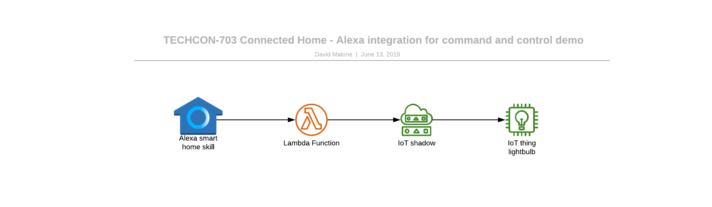


## BOM

* [AWS Account](http://aws.amazon.com/console)
* [Amazon Developer Account](https://developer.amazon.com/)
* ESP32 DevKitC
* ESP32 Breakout Board (contact antonsh@ for ordering)
* Amazon Echo Device


## Amazon FreeRTOS

This demo incorporates the ESP32 breakout board developed by Espressif and [Anton Shmagin](https://github.com/yona75). The Amazon FreeRTOS fork developed for use with that board controls WS2812 addressable LEDs on the board based on AWS IoT Core Shadow configuration. The Alexa skill built and deployed above updates the Shadow configuration for your device based on the voice command given (lights on, lights off, etc).


In order to compile the code in the Cloud9 environment please execute following sections.

### Create Cloud9 Environment

1. Log in to your AWS Account Console and search for Cloud9

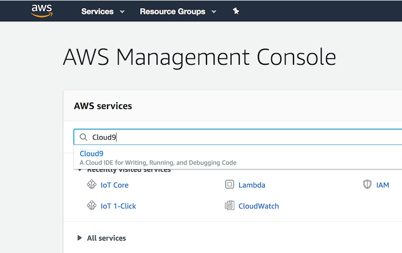

2. Create New Environment


- name your environment and provide a description, then press *Next step*

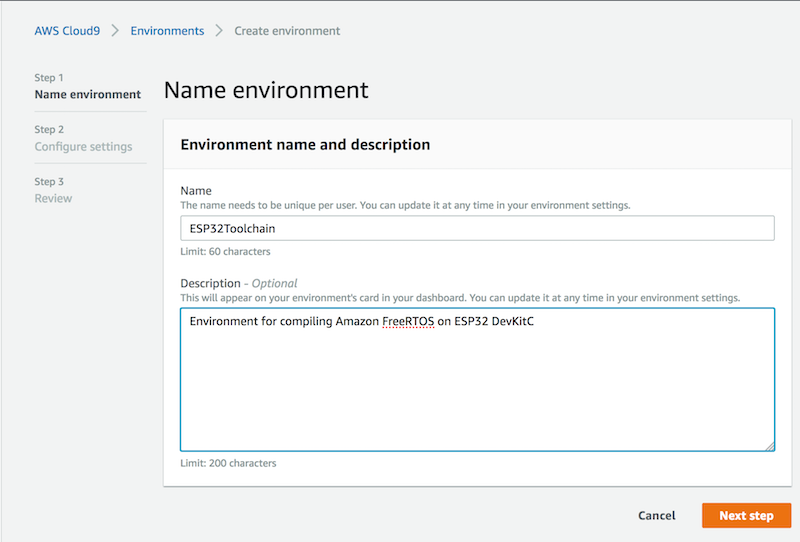

- use t2.micro instance
- set up auto-hibernate option
- press *Next step*

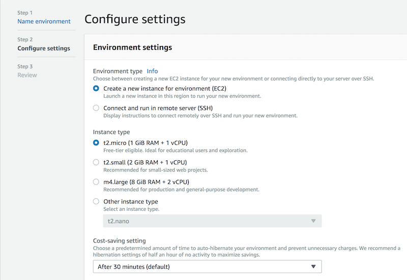

- review and press *Create environment*

3. Open new Terminal window

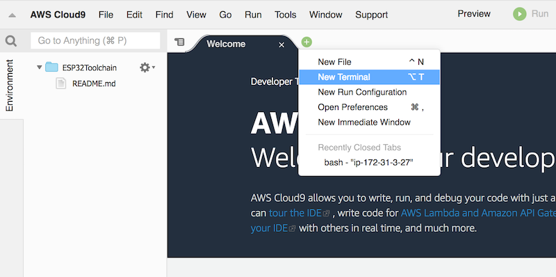


### Installing ESP32 toolchain

Setup toolchain for ESP32

1. In the Cloud9 Terminal window install prerequisites

```bash
sudo yum install flex gperf
sudo pip install argparse cryptography pyserial
```

2. Download 64-bit version of Xtensa ESP32 toolchain:

```bash
cd ~/environment
wget https://dl.espressif.com/dl/xtensa-esp32-elf-linux64-1.22.0-80-g6c4433a-5.2.0.tar.gz
```

3. Create *esp* directory and unzip the tar archive there:

```bash
mkdir ~/environment/esp
cd ~/environment/esp
tar xvfz ../xtensa-esp32-elf-linux64-1.22.0-80-g6c4433a-5.2.0.tar.gz
```

4. Add toolchain path to *~/.bash_profile* PATH variable

```bash
echo "PATH=\$PATH:\$HOME/environment/esp/xtensa-esp32-elf/bin" >> ~/.bash_profile
```

5. Re-evaluate ~/bash_profile

```bash
source ~/.bash_profile
```

### Compiling Amazon FreeRTOS code

Steps to compile firmware for ESP32

1. Clone the repo:

```bash
git clone https://github.com/aws-samples/aws-iot-alexa-connected-home-demo
```

2. Navigate to *~/environment/esp/techcon-703/amazon-freertos/tools/aws_config_quick_start/ and open file configure.json*
Edit you *Thing name, WiFi credentials, and WiFi security* mode which should be *eWiFiSecurityWPA2*

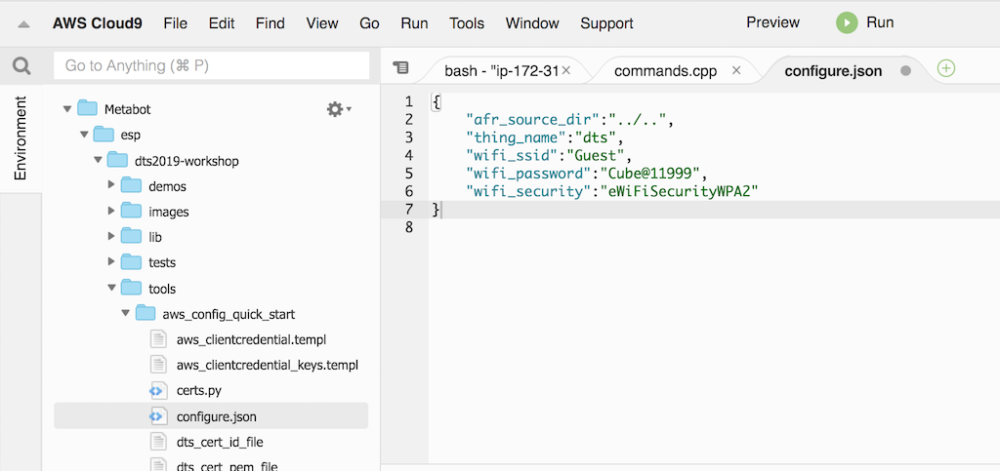

3. Save the file

4. In the Terminal window navigate to *~/environment/esp/techcon-703/amazon-freertos/tools/aws_config_quick_start* and execute *python SetupAWS.py setup* command to provision your *Thing, Certificate, and Policy*:

```bash
cd ~/environment/esp/techcon-703/amazon-freertos/tools/aws_config_quick_start
python SetupAWS.py setup
```

If successful command will not produce any output, but you can verify in AWS IoT Core Console that new Thing, Certificate and Policy were created.

5. In the Terminal window navigate to *esp32_devkitc_esp_wrover_kit/make* and execute *make menuconfig* command:

```bash
cd ~/environment/esp/techcon-703/amazon-freertos/demos/espressif/esp32_devkitc_esp_wrover_kit/make
make menuconfig
```

6. Click *Save* and then *Exit*

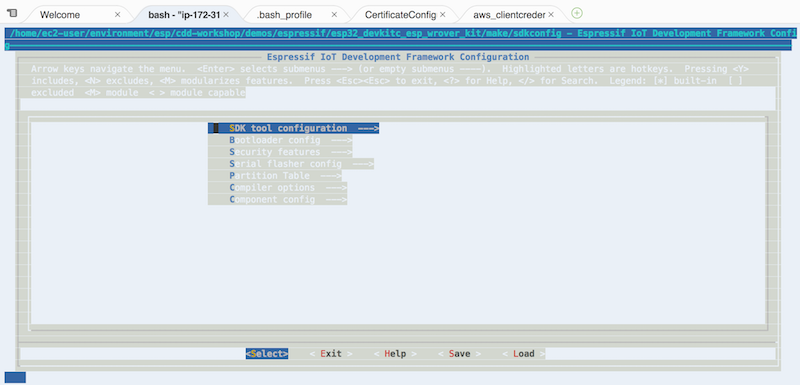

7. Execute *make* command

```bash
make
```

10. Once compilation is done, download these 3 files to your local computer:
- *build/aws_demos.bin*
- *build/partitions_example.bin*
- *build/bootloader/bootloader.bin*

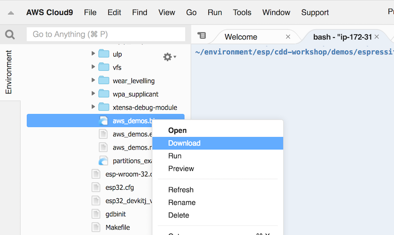

11. Flash the firmware and observe console output as described in the next section [Uploading compiled firmware to ESP32 development board](#uploading-compiled-firmware-to-esp32-development-board)


### Uploading compiled firmware to ESP32 development board

Flashing Amazon FreeRTOS compiled firmware to your ESP32 board

1. Download and install Silicon Labs [CP2104 drivers](https://www.silabs.com/products/development-tools/software/usb-to-uart-bridge-vcp-drivers)

2. Connect your ESP32 DevKitC board to the laptop using provided USB cable and identify which port it is connected to
On Windows it will be ```COM3``` for example, on Mac OS typically it enumerated as ```/dev/tty.SLAB_USBtoUART``` and on Linux most likely ```/dev/ttyUSB0```

3. Install [esptool](https://github.com/espressif/esptool) and flash the firware

**Windows**
- Download binary from [here](https://dl.espressif.com/dl/esptool-2.3.1-windows.zip)
- Drop it to the subfolder that already in your PATH or add subfolder you placed esptool to your PATH variable
- Open Commnd Prompt and execute following command (from the directory you places 3 downloaded files):
```
esptool --chip esp32 --port COM3 --baud 921600 --before default_reset --after hard_reset write_flash -z --flash_mode dio --flash_freq 40m --flash_size detect 0x1000 bootloader.bin 0x20000 aws_demos.bin 0x8000 partitions_example.bin
```

**Mac/Linux**
- Install esptool.py:
```bash
sudo pip install esptool pyserial
```
- Execute following command from the directory you placed 3 downloaded files:
```bash
esptool.py --chip esp32 --port /dev/tty.SLAB_USBtoUART --baud 921600 --before default_reset --after hard_reset write_flash -z --flash_mode dio --flash_freq 40m --flash_size detect 0x1000 bootloader.bin 0x20000 aws_demos.bin 0x8000 partitions_example.bin
```
4. Monitor the flashing process:

```bash
bash-3.2$ esptool.py --chip esp32 --port /dev/tty.SLAB_USBtoUART --baud 921600 --before default_reset --after hard_reset write_flash -z --flash_mode dio --flash_freq 40m --flash_size detect 0x1000 bootloader.bin 0x20000 aws_demos.bin 0x8000 partitions_example.bin
esptool.py v2.5.1
Serial port /dev/tty.SLAB_USBtoUART
Connecting........__
Chip is ESP32D0WDQ5 (revision 1)
Features: WiFi, BT, Dual Core
MAC: 24:0a:c4:23:de:7c
Uploading stub...
Running stub...
Stub running...
Changing baud rate to 921600
Changed.
Configuring flash size...
Auto-detected Flash size: 4MB
Flash params set to 0x0220
Compressed 21936 bytes to 13046...
Wrote 21936 bytes (13046 compressed) at 0x00001000 in 0.2 seconds (effective 1145.0 kbit/s)...
Hash of data verified.
Compressed 628432 bytes to 398564...
Wrote 628432 bytes (398564 compressed) at 0x00020000 in 5.9 seconds (effective 854.5 kbit/s)...
Hash of data verified.
Compressed 3072 bytes to 119...
Wrote 3072 bytes (119 compressed) at 0x00008000 in 0.0 seconds (effective 3255.9 kbit/s)...
Hash of data verified.

Leaving...
Hard resetting via RTS pin...
```

5. Monitor code execution through the serial console

**Windows**

5.1.1 Install PuTTY

- You can download putty from http://www.putty.org/ or http://www.chiark.greenend.org.uk/~sgtatham/putty/download.html

5.1.2 Run Installation wizard

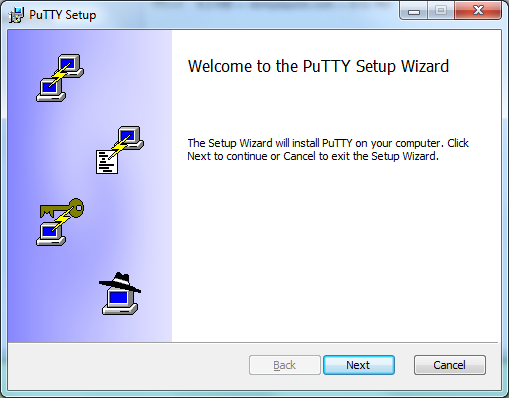

5.1.3 Check all options

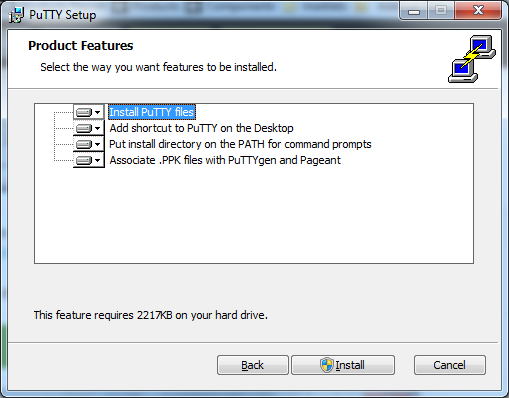

5.1.4 Setup the port and speed (Port ```COM3``` and ```115200``` in our case)

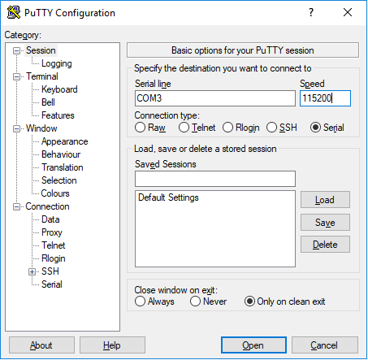

5.1.5 Open console access to ESP32

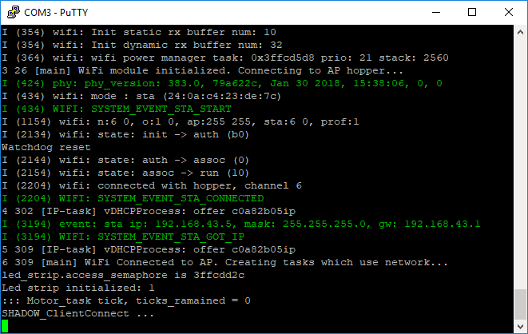


**Mac/Linux**

5.2.1 Use ```screen``` command to see the ESP32 console:

```bash
screen /dev/tty.SLAB_USBtoUART 115200
```

5.2.2 In order to exit screen press ```Ctrl + A``` and then ```K```


### Testing the Device

1. In AWS Console navigate to AWS IoT Core -> Manage -> #YOUR THING NAME# -> Shadow
  Observe the sensors output

2. Edit the *desired* section of the demo to set LED colors (Insert this BEFORE *reported* section)
```json
  "desired": {
    "leds": [
      {
        "red": 16,
        "green": 0,
        "blue": 0
      },
      {
        "red": 0,
        "green": 15,
        "blue": 0
      },
      {
        "red": 0,
        "green": 0,
        "blue": 15
      },
      {
        "red": 15,
        "green": 15,
        "blue": 0
      },
      {
        "red": 0,
        "green": 15,
        "blue": 15
      }
    ]
  },
  ```

## Alexa Smart Home Skill

Your Alexa Smart Home Skill will be comprised of a few components. First, there is the Alexa Skill itself. The Alexa Skill is then configured to invoke a custom piece of NodeJS code running as an AWS Lambda function.

The second component, the Lambda function, acts as the interface between Alexa devices and your IoT device; it receives and interprets the voice commands from your Alexa skill and uses those commands to update the AWS IoT Thing Shadow document based on the command you give it. The Lambda function also serves other specific needs for Alexa Smart Home skills, including device discovery.

The final component is the authentication and authorization server. In order to allow for secure communication between Alexa Smart Home skills and devices deployed within the home or corporate environments, an OAuth 2.0 provider is used to enable users of the skill to associate their devices with skill developer's device cloud accounts. For our example, we will use [Login with Amazon](http://login.amazon.com/).

### Create your Alexa Smart Home Skill in the Developer Console:

Follow these instructions, using Login With Amazon (LWA) for your Smart Home Skill:
https://github.com/alexa/alexa-smarthome/wiki/Build-a-Working-Smart-Home-Skill-in-15-Minutes

**TODO** - inline instructions here

### Deploy Lambda Function

From your Cloud9 terminal, execute the following commands:

```bash

sudo yum install jq

cd ~/environment/esp/techcon-703

AWS_IOT_THING_NAME=#your-thing-name-from-above#
ALEXA_SKILL_ID=#your alexa skill ID from above#
DEMO_S3_BUCKET=iot-connected-home-alexa-demo
AWS_IOT_ENDPOINT=$(aws iot describe-endpoint --endpoint-type iot:Data-ATS | jq -r '.endpointAddress')

aws s3 mb s3://${DEMO_S3_BUCKET}

sam package \
    --output-template-file packaged.yml \
    --s3-bucket ${DEMO_S3_BUCKET}

aws cloudformation deploy \
    --template-file packaged.yml \
    --stack-name iot-connected-home-alexa-demo \
    --capabilities CAPABILITY_NAMED_IAM \
    --region us-east-1 \
    --parameter-overrides IoTAtsEndpoint=${AWS_IOT_ENDPOINT} ThingName=${AWS_IOT_THING_NAME} AlexaSkillID=${ALEXA_SKILL_ID}
```

### Connect your Alexa Skill to your Lambda function

**TODO** - inline the "Connect the Lambda function to your Skill" and "Configure the trigger for a Lambda function" instructions here: https://developer.amazon.com/docs/custom-skills/host-a-custom-skill-as-an-aws-lambda-function.html#connect-to-skill

## Resources

* https://developer.amazon.com/docs/smarthome/understand-the-smart-home-skill-api.html
* https://github.com/alexa/alexa-smarthome/wiki/Build-a-Working-Smart-Home-Skill-in-15-Minutes
* https://github.com/yona75/dts2019-workshop
* [AWS CLI](https://docs.aws.amazon.com/cli/latest/userguide/index.html)
* [AWS SAM CLI](https://github.com/awslabs/aws-sam-cli)
